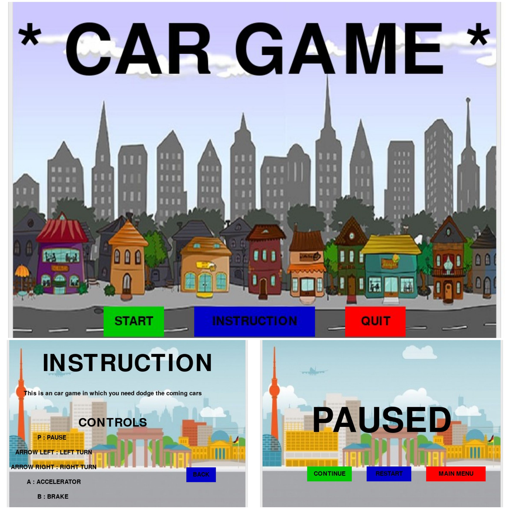
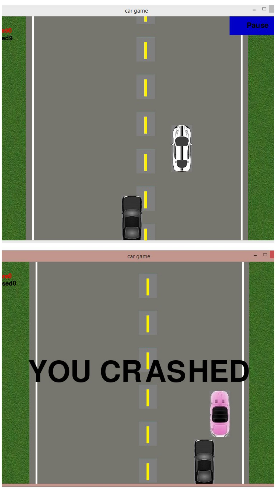

#Cargame
-------------------------------------
DESCRIPTION OF GAME:   

just a car game in which your car passes from other cars and your score increases until you crash 

Library used: Pygame-
It is a set of Python modules designed for writing video games. Pygame adds functionality on top of the excellent SDL library. This allows you to create fully featured games and multimedia programs in the python language.

Documentation- https://www.pygame.org/docs/

some screenshots of game:

 
